# Git Rebase Explained to Infinity

- [Too Long To Read?](#too-long-to-read)
- [Rebase Workflow Full Lifecycle](#rebase-workflow-full-lifecycle)
- [Unified Force-Push Workflow for Linear History](#unified-force-push-workflow-for-linear-history)
- [Rebase Workflow Mechanics and SHA Divergence](#rebase-workflow-mechanics-and-sha-divergence)
- [What is a "Lease" in Git?](#what-is-a-lease-in-git)
- [Mechanics of --force-with-lease](#mechanics-of---force-with-lease)
- [Mechanics of --force-if-includes](#mechanics-of---force-if-includes)
- [Enemies of Rebase: Merges, IDEs & Misconfigured Repositories](#enemies-of-rebase-merges-ides--misconfigured-repositories)

---

## Too Long To Read?

- Git rebase workflow keeps the history linear. Do not user merge.

- Set this variables to prevent git bad advise on a rebase workflow:
```bash
git config --global advice.pushNonFFCurrent false
git config --global advice.pushNonFFMatching false
git config --global advice.pushFetchFirst false
git config --global advice.pushRefNeedsUpdate false
git config --global advice.pushNeedsForce false
```
**Why?** Because git default messages are made for a generic workflow, not for a strict rebase. They recommend you to use `git pull` which will create a merge in default behavior, and `--force` which may destruct other people's work, never to be used in rebase workflow. They give these messages:

```bash
advice.pushNonFFCurrent   # "use 'git pull' before pushing again." Current branch is behind remote.

advice.pushNonFFMatching  # "use 'git pull' before pushing again." Another pushed branch is behind remote.

advice.pushFetchFirst     # "use 'git pull' before pushing again." Remote has work not present locally.

advice.pushRefNeedsUpdate # "use 'git pull' before pushing again." Remote-tracking branch changed since checkout.

advice.pushNeedsForce     # "without using the '--force' option." Ref involves a non-commit object.
```

- Avoid standard `git pull` because it does a `git fetch` and then a `git merge`. If you know what you do, use `git pull --rebase` or set it to always use rebase: 
```bash
git config --global pull.rebase true
```
- rebase your local feature branch to development with

```bash
git fetch origin
git rebase
```

- create alias `freshrebase` or fetchrebase:
```bash
git config --global alias.freshrebase '!git fetch && git rebase'
```
- You will likely need to force push to update your PR after a rebase. Use

```bash
git push --force-with-lease --force-if-includes
```
- create alias `pushsafe`:

```bash
git config --global alias.pushsafe "push --force-with-lease --force-if-includes"
```
*Now you rebase with `git freshrebase` and after your work is done you push with `git pushsafe`*

- set --force-if-includes as default

```bash
git config --global push.useForceIfIncludes true
```


## Rebase Workflow Full Lifecycle

This section outlines the complete lifecycle of a feature branch in a rebase-based workflow, from creation to merging. 

### Feature Branch Lifecycle

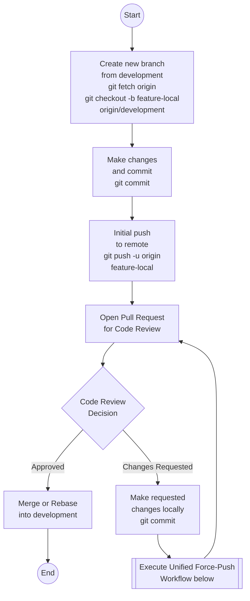

This diagram provides a high-level view of the process. See next section for the critical part. 

---

## Unified Force-Push Workflow for Linear History

Git rebase workflow rewrites history locally and then updates the remote branch. The safest way is by using the [`--force-with-lease`](#mechanics-of---force-with-lease) and [`--force-if-includes`](#mechanics-of---force-if-includes) flags.

The beauty of this approach is that you **do not need to know the exact state of the remote or local tracking branches**. A single, unified workflow covers all scenarios safely.

### The Workflow Decision Tree

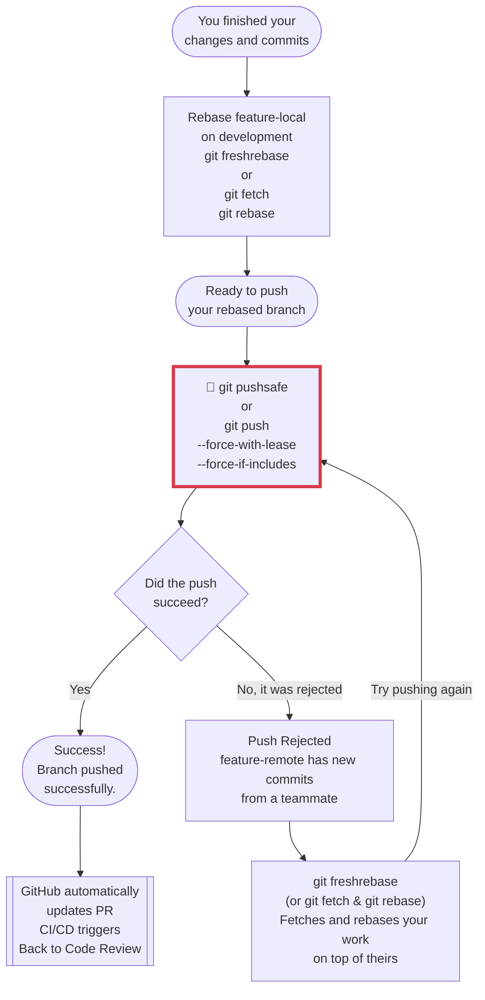

### How It Covers Every Scenario

- **Case 1: No one added anything new in feature-remote (e.g., you just rebased locally to update your PR after a code review)**
   - You run the initial push.
   - Git verifies that the remote matches your knowledge of it.
   - **Result:** Success. Your new rebased commits are pushed, and the old pre-rebase commits on the remote become orphaned and are replaced.

- **Case 2: A teammate pushed new commits to your shared feature branch, feature-remote**
   - You run the initial push.
   - It **fails** because `--force-with-lease` detects that the remote branch has moved forward unexpectedly.
   - You run `git freshrebase` or `git fetch` then `git rebase` to fetch their commits and replay your work on top.
   - You push again successfully.

- **Case 3: A teammate pushed new commits AND a background fetch happened**
   - You run the initial push.
   - It **fails** because `--force-if-includes` detects that while your machine knows about the new commits, you haven't integrated them into your local history yet.
   - You run `git freshrebase` or `git fetch` then `git rebase`. Since the commits were already fetched, it skips the download and directly rebases your work on top of them.
   - You push again successfully.

---

## Rebase Workflow Mechanics and SHA Divergence

Git gives advice that is not ok for a rebase workflow. Here we will explain the wrong advice and the correct action to take.

You can modify these variables to prevent that bad advise when working with Rebase workflow for linear history.

```bash
git config --global advice.pushNonFFCurrent false
git config --global advice.pushNonFFMatching false
git config --global advice.pushFetchFirst false
git config --global advice.pushRefNeedsUpdate false
git config --global advice.pushNeedsForce false
```

### Rebase basics:
- Rebase works always on the local branch
- Rebase means also reSHA (creates new commits with different SHA)
- When a branch is rebased, the base commit changes. Because a Git commit's SHA-1 hash is mathematically calculated using its parent commit, changing the parent generates an entirely new SHA for the commit, even if the code changes are identical.

**Example Scenario**
1. You push a feature branch with commits `F1 (a1b2)` and `F2 (c3d4)` for code review to its corresponding remote branch `feature-remote`.
2. The `development` branch receives new commits (`C3`) from other users.
3. Reviewers want changes. You update your local feature-local branch by rebasing it onto the updated `development` branch to prevent integration conflicts later.
4. You continue working locally, adding `F3`.

Your local branch `feature-local` now contains `F1' (e5f6)`, `F2' (g7h8)`, and `F3`. The remote branch `feature-remote` still contains the original `F1 (a1b2)` and `F2 (c3d4)`. When you attempt to push, Git rejects the operation because `feature-remote` cannot be updated via a simple fast-forward.

Following Git's default advice in this state breaks the linear history required by a rebase workflow.

***

### Case 1: `advice.pushNonFFCurrent` & `advice.pushNonFFMatching`
**When git gives this advice?** Pushing a rebased local branch to its corresponding remote branch that contains the "same" pre-rebase commits.

**Default git advice:** Run `git pull` to integrate changes.

**Before Following Bad git Advice**
The remote branch holds the original commits. The local branch holds the rebased commits with new SHAs.

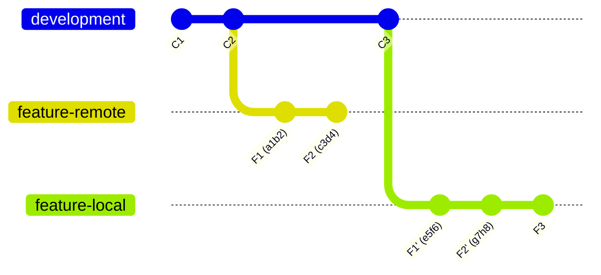

**After Following Bad git Advice (`git pull`)**
Git pulls the old `F1 (a1b2)` and `F2 (c3d4)` from the remote and merges them into your local branch.

**Resulting Issue:** 
Duplicate commits appear in the history, and an unnecessary merge commit (`M1`) is created, destroying the linear rebase history.

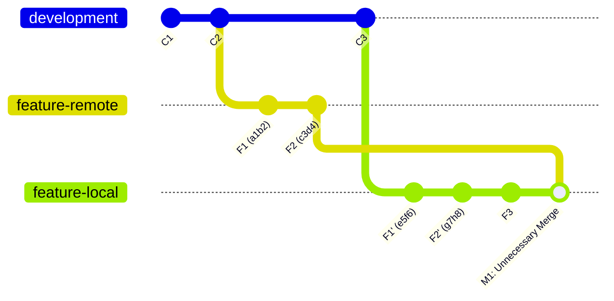

**Correct Action (`git push --force-with-lease`)**
Forces the remote pointer to match the local rebased history. The old remote commits become orphaned and the branches are identical.

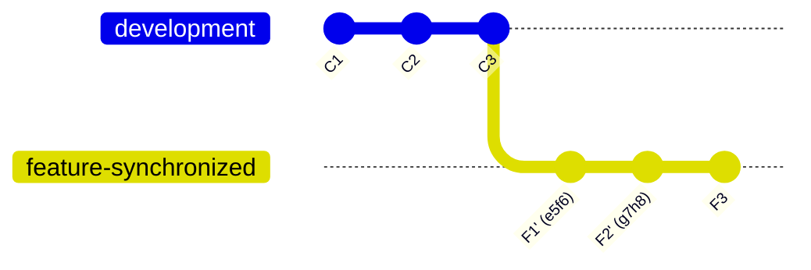

> **Note:** The branch name `feature-synchronized` in these diagrams represents that both `feature-local` and `feature-remote` are now identical and point to the exact same history.

***

### Case 2: `advice.pushFetchFirst` & `advice.pushRefNeedsUpdate`
**When git gives this advice?** A teammate pushes new commits to the remote feature branch while you are working locally on the same branch.

**Default git advice:** Run `git pull` to fetch and merge the remote changes.

**Before Following Bad git Advice**
You have a local commit (`F4`), and your teammate pushed a commit (`F3`) to the remote.

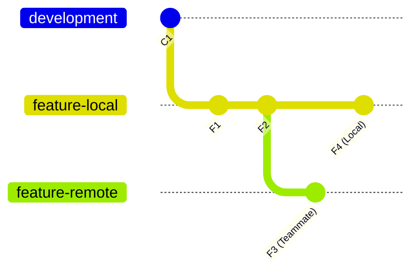

**After Following Bad git Advice (`git pull`)**
Git defaults to a merge strategy.

**Resulting Issue:** 
A merge commit is created inside the feature-local. Feature branches must remain perfectly linear in a rebase workflow.

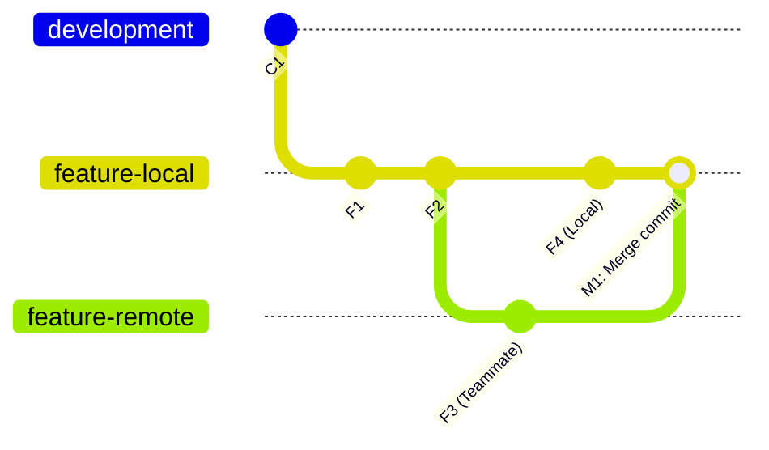

**Correct Action (`git freshrebase` or `git fetch` then `git rebase`)**
Fetches your teammate's `F3` commit and replays your `F4` commit on top of it, maintaining a linear history.

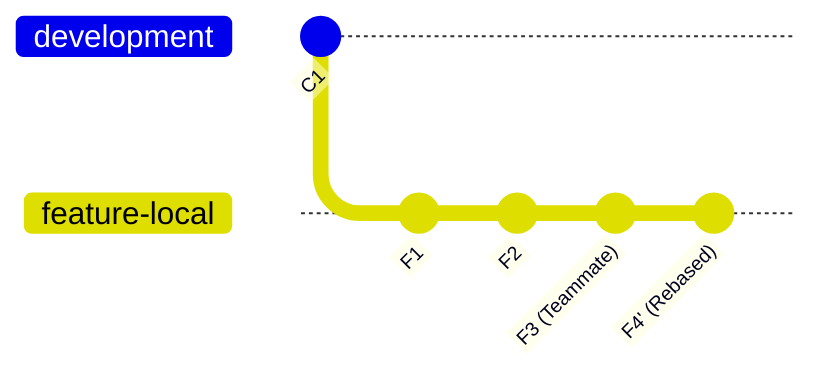

***

### Case 3: `advice.pushNeedsForce`
**When git gives this advice?** Pushing a rebased branch requires a force push, but the remote branch has new commits from a teammate.
**Default git advice:** Run `git push --force`.

**Before Following Bad git Advice**
You rebased locally. Unbeknownst to you, a teammate pushed `F3 (k1n2)` to the remote branch.

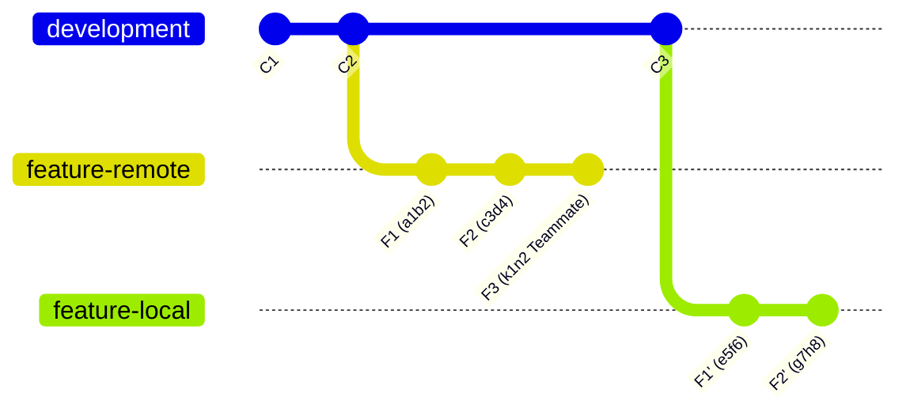

**After Following Bad git Advice (`git push --force`)**
Standard `--force` blindly overwrites the remote pointer with your local pointer.

**Resulting Issue:**
Teammate's commit `F3 (k1n2)` is permanently orphaned and deleted from the remote history.

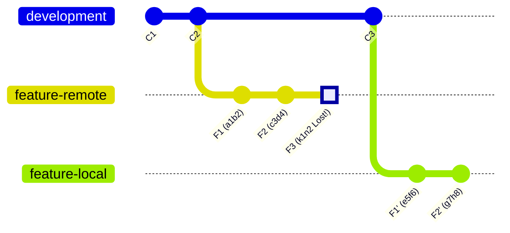

**Correct Action (`git pushsafe` or `git push --force-with-lease --force-if-includes`)**
The push is safely rejected because the remote has unexpected new commits. You then fetch and rebase to include the teammate's work.

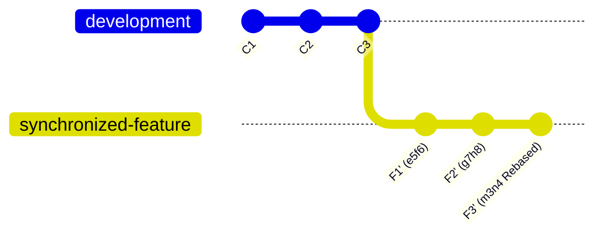

***

### Case 4: `advice.pushAlreadyExists`
**When git gives this advice?** You create and attempt to push a new local branch, but a branch with the exact same name already exists on the remote with entirely unrelated history.
**Default git advice:** Run `git pull` to fetch and integrate.

**Before Following Bad git Advice**
Two completely distinct Git histories exist.

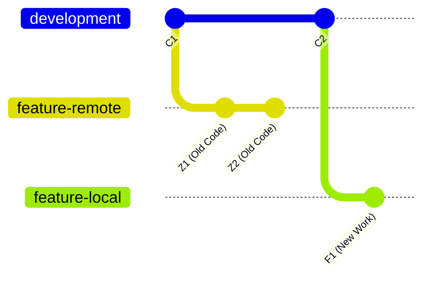

**After Following Bad git Advice (`git pull`)**
Git forces the merge of unrelated histories.

**Resulting Issue:**
Your new feature branch is polluted with old, irrelevant commits.

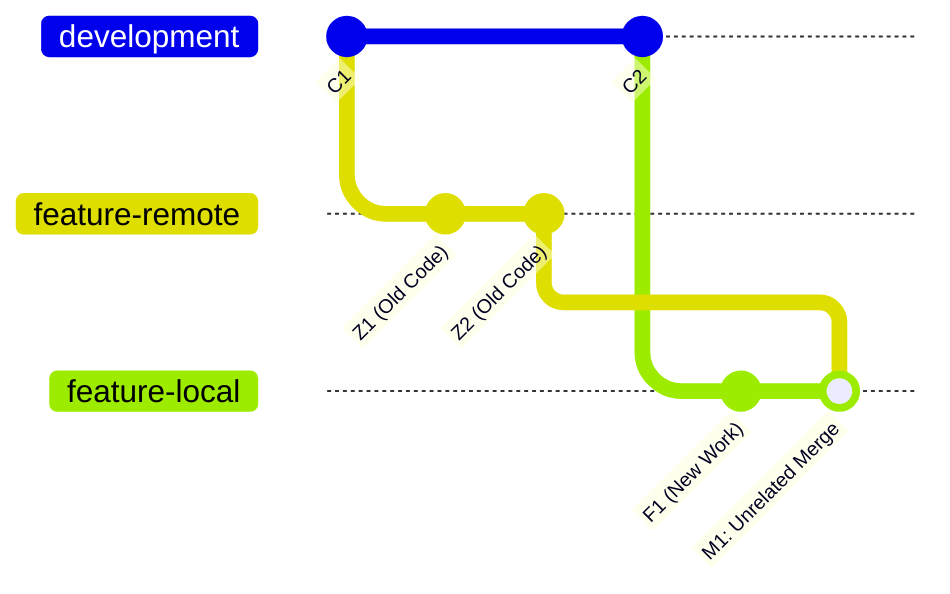

**Correct Action:**
```bash
git push origin --delete feature-branch
git push origin feature-branch
```
Or rename local branch.

Do NOT use `git push --force`. It's gonna work, but it's better to forbid --force option globally for your team. So nobody develops the muscular memory of using --force in any case. Also, writing --delete is an explicit intention.

If you are certain the old remote branch is obsolete, overwrite it. Alternatively, rename your local branch.

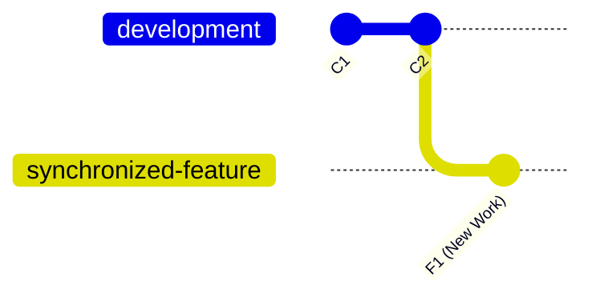

---

## What is a "Lease" in Git?

### Etymology
In standard English, a "lease" is a contract granting temporary use of property (like renting). However, its etymological root comes from Latin *laxare* (to let, allow, or grant permission).

### Origin in Computer Science
In distributed systems and network architecture, a "lease" refers to a conditional lock or a contract. It grants a client the right to mutate a shared resource, provided that specific conditions remain true at the exact moment the mutation is applied.

### Application in Git
In the command `git push --force-with-lease`, Git relies directly on both the Latin root (granting permission) and the CS concept (conditional lock). 

**The Contract:** You ask the server to **grant permission** to overwrite the remote history strictly under one condition: the remote pointer must perfectly match your local tracking reference (e.g., `origin/feature-remote`).

- **Valid Lease:** If no one else has pushed changes, the remote repository matches your local cache. The lease is valid, and Git executes the force push.
- **Broken Lease:** If a teammate pushed new commits, the remote pointer has advanced. Your local cache is outdated, meaning your lease is broken. Git rejects the push to prevent data loss.

This mechanism is a direct implementation of *optimistic concurrency control*, functioning exactly like an ETag in an HTTP API or a version token in a database record.

---

## Mechanics of --force-with-lease

### How it works
Standard `git push --force` blindly overwrites the remote branch with your local branch, regardless of what is currently on the server. This is highly destructive in a team environment.

`--force-with-lease` adds a safety check. Before pushing, Git compares the state of the branch on the remote server against your local remote-tracking branch (e.g., `origin/feature-remote`).
- If the remote server matches your local tracking branch, the push succeeds (your "lease" is valid).
- If the remote server has new commits that you haven't fetched yet, the push is rejected (your "lease" is broken). This prevents you from unknowingly overwriting a teammate's work.

### Workflow Scenario
1. You and a teammate are collaborating on `feature-remote`.
2. You rebase your local branch.
3. Meanwhile, your teammate pushes a new commit to `feature-remote`.
4. You attempt to push your rebased code using `git push --force-with-lease`.
5. **Result:** Git rejects the push because the remote server has your teammate's new commit, but your machine doesn't know about it yet. Your teammate's work is protected. You must fetch and integrate their changes before trying again.

---

## Mechanics of --force-if-includes

### How it works
While `--force-with-lease` is safe, it has one major vulnerability: **background fetching**. If an IDE or script runs `git fetch` in the background, your local `origin/feature-remote` gets updated with your teammate's new commits. 

If this happens, the lease check passes (because your tracking branch now matches the server). Git will proceed with the overwrite, destroying your teammate's commits because you haven't actually integrated them into your working code.

`--force-if-includes` closes this loophole by adding a second safety check: it verifies that the commit at the tip of the remote-tracking branch is actually *included* in the history of your local working branch.

### Workflow Scenario
1. You rebase your local branch.
2. Your teammate pushes a new commit to `feature-remote`.
3. Your IDE runs `git fetch` in the background. Your local tracking branch is updated, but you haven't merged or rebased those new changes into your local code.
4. You attempt to push using `git push --force-with-lease --force-if-includes`.
5. **Result:** The lease check passes, but the includes check **fails** because your teammate's commit is not in your local history. The push is safely rejected, preventing data loss.


---

## Enemies of Rebase: Merges, IDEs & Misconfigured Repositories

A strict rebase workflow relies on a linear commit history. These are the most common ways it gets destroyed:

### Accidental Merges
- **Default `git pull`:** Running `git pull` creates an automatic merge commit. Avoid `git pull` entirely. Always use your `freshrebase` alias (`git fetch && git rebase`).
- **The UI Green Button:** GitHub/GitLab "Merge Pull Request" buttons default to a merge commit. Repository admins MUST disable merge commits and enforce "Squash and merge" or "Rebase and merge" in repository settings.
- **Syncing Forks via UI:** Clicking "Sync fork" in web interfaces might generate a merge commit. Fetch upstream and rebase locally instead.

### Intentional Merges
- **Catching up long-lived branches:** Running `git merge main` to sync a feature branch creates a redundant loop. Always use `git rebase main`.
- **Fear of conflicts:** Rebasing applies commits sequentially, sometimes forcing you to resolve the exact same conflict multiple times. Overwhelmed developers might abort and run `git merge` to resolve everything at once. *(Tip: Look into `git rerere` - Reuse recorded resolution, to auto-resolve repeated conflicts).*

### The Consequences
- **Spaghetti History:** Git graph becomes unreadable, rendering debugging tools (`git bisect`) useless.
- **Duplicate Commits:** Rebasing a branch that already contains a merge commit reapplies all commits, duplicating SHAs and causing severe conflicts.
- **Nightmare Reverts:** Reverting a merge commit requires explicitly specifying the mainline parent (`git revert -m 1`). It is error-prone and blocks future re-integration.


### References
* [Git Push Documentation](https://git-scm.com/docs/git-push)
* [Mermaid gitGraph Documentation](https://mermaid.js.org/syntax/gitgraph.html)
