# Rebase Workflow Mechanics and SHA Divergence

Git gives advice that is not ok for a rebase workflow. This document explains the wrong advice and the correct action to take.

You can modify these variables to prevent that bad advise when working with Rebase workflow for linear history.

```bash
git config --global advice.pushNonFFCurrent false
git config --global advice.pushNonFFMatching false
git config --global advice.pushFetchFirst false
git config --global advice.pushRefNeedsUpdate false
git config --global advice.pushNeedsForce false
```

## Rebase basics:
- Rebase works always on the local branch
- Rebase means also resha (creates new commits with different SHA)
- When a branch is rebased, the base commit changes. Because a Git commit's SHA-1 hash is mathematically calculated using its parent commit, changing the parent generates an entirely new SHA for the commit, even if the code changes are identical.

**Example Scenario**
1. You push a feature branch with commits `F1 (a1b2)` and `F2 (c3d4)` for code review to its corresponding remote branch `feature-remote`.
2. The `development` branch receives new commits (`C3`) from other users.
3. Reviewers want changes. You update your local feature-local branch by rebasing the feature-local branch onto the updated `development` branch to prevent integration conflicts later.
4. You continue working locally, adding `F3`.

Your local branch `feature-local` now contains `F1' (e5f6)`, `F2' (g7h8)`, and `F3`. The remote branch `feature-remote` still contains the original `F1 (a1b2)` and `F2 (c3d4)`. When you attempt to push, Git rejects the operation because `feature-remote` cannot be updated via a simple fast-forward.

Following Git's default advice in this state breaks the linear history required by a rebase workflow.

***

### Case 1: `advice.pushNonFFCurrent` & `advice.pushNonFFMatching`
**When git gives this advice:** Pushing a rebased local branch to a its corresponding remote branch (or a another remote branch) that contains the "same" pre-rebase commits.
**Default git advice:** Run `git pull` to integrate changes.

**Before Following Bad git Advice**
The remote branch holds the original commits. The local branch holds the rebased commits with new SHAs.

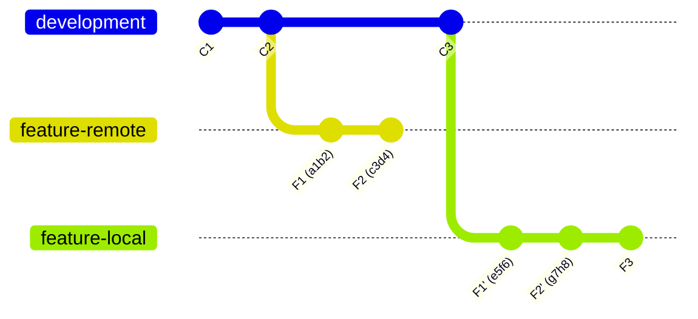

**After Following Bad git Advice (`git pull`)**
Git pulls the old `F1 (a1b2)` and `F2 (c3d4)` from the remote and merges them into your local branch.

**Resulting Issue:** 
Duplicate commits appear in the history, and an unnecessary merge commit (`M1`) is created, destroying the linear rebase history.

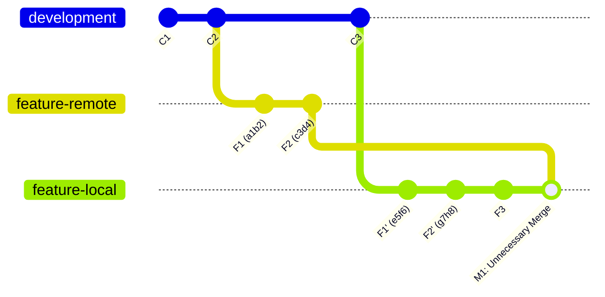

**Correct Action (`git push --force-with-lease`)**
Forces the remote pointer to match the local rebased history. The old remote commits become orphaned and the branches are identical.

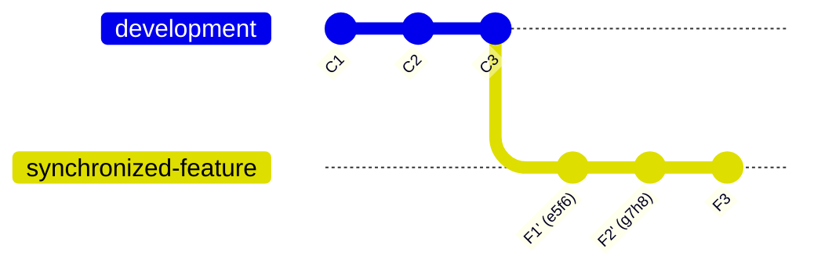

***

### Case 2: `advice.pushFetchFirst` & `advice.pushRefNeedsUpdate`
**When git gives this advice:** A teammate pushes new commits to the remote feature branch while you are working locally on the same branch.
**Default git advice:** Run `git pull` to fetch and merge the remote changes.

**Before Following Bad git Advice**
You have a local commit (`F4`), and your teammate pushed a commit (`F3`) to the remote.

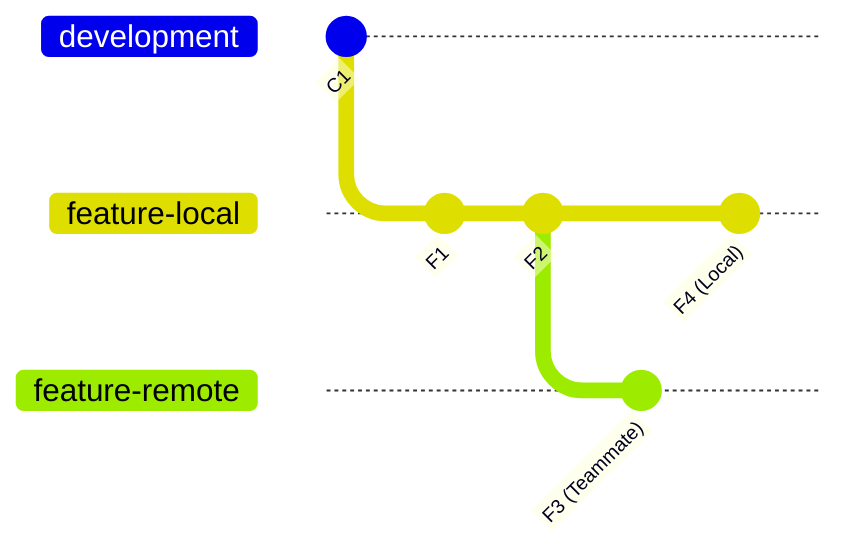

**After Following Bad git Advice (`git pull`)**
Git defaults to a merge strategy.

**Resulting Issue:** 
A merge commit is created inside the feature-local. Feature branches must remain perfectly linear in a rebase workflow.

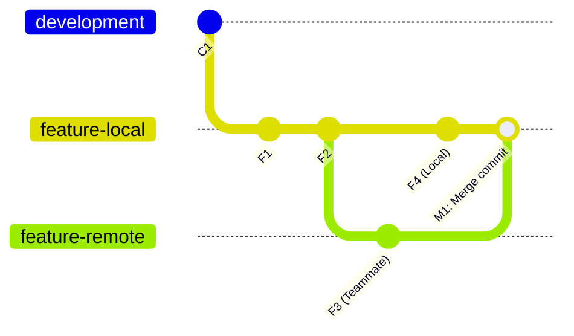

**Correct Action (`git pull --rebase`)**
Fetches your teammate's `F3` commit and replays your `F4` commit on top of it, maintaining a linear history.

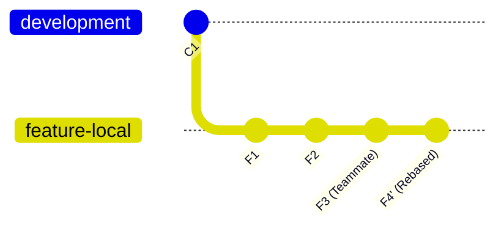

***

### Case 3: `advice.pushNeedsForce`
**When git gives this advice:** Pushing a rebased branch requires a force push, but the remote branch has new commits from a teammate.
**Default git advice:** Run `git push --force`.

**Before Following Bad git Advice**
You rebased locally. Unbeknownst to you, a teammate pushed `F3 (k1n2)` to the remote branch.

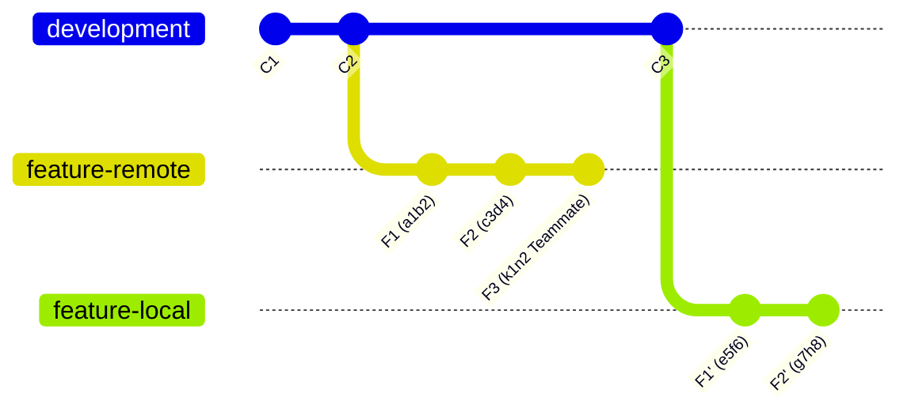

**After Following Bad git Advice (`git push --force`)**
Standard `--force` blindly overwrites the remote pointer with your local pointer.

**Resulting Issue:**
Teammate's commit `F3 (k1n2)` is permanently orphaned and deleted from the remote history.

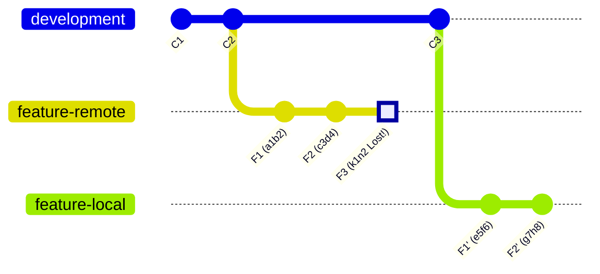

**Correct Action (`git push --force-with-lease`)**
The push is safely rejected because the remote has unexpected new commits. You then fetch and rebase to include the teammate's work.

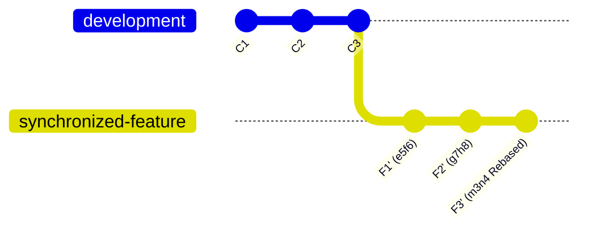

***

### Case 4: `advice.pushAlreadyExists`
**When git gives this advice:** You create and attempt to push a new local branch, but a branch with the exact same name already exists on the remote with entirely unrelated history.
**Default git advice:** Run `git pull` to fetch and integrate.

**Before Following Bad git Advice**
Two completely distinct Git histories exist.

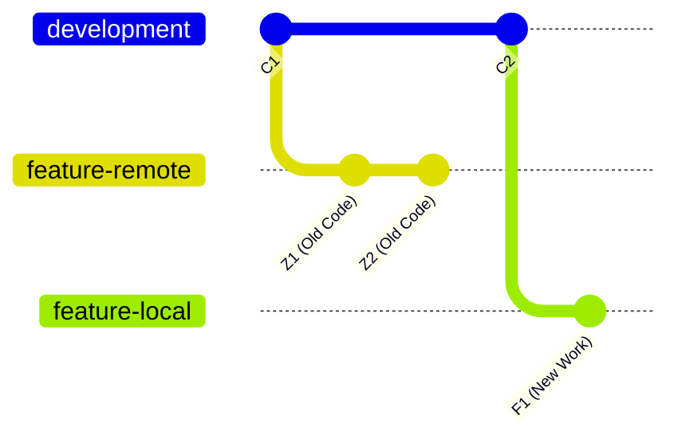

**After Following Bad git Advice (`git pull`)**
Git forces the merge of unrelated histories.

**Resulting Issue:**
Your new feature branch is polluted with old, irrelevant commits.

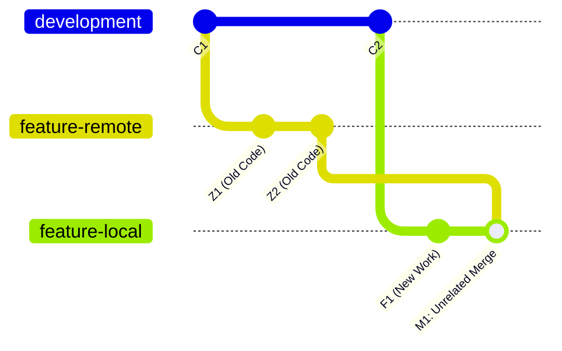

**Correct Action (`git push --force` or rename local branch)**
If you are certain the old remote branch is obsolete, overwrite it. Alternatively, rename your local branch.

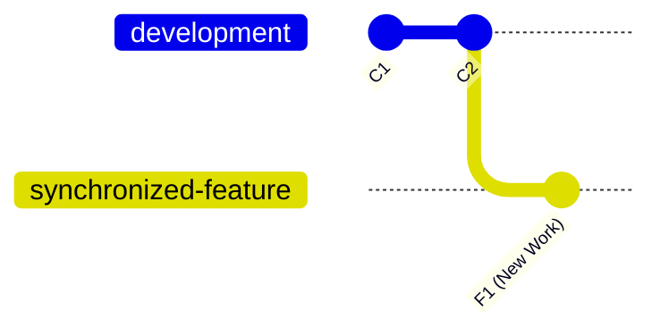

### References
* [Git Push Documentation](https://git-scm.com/docs/git-push)
* [Mermaid gitGraph Documentation](https://mermaid.js.org/syntax/gitgraph.html)
