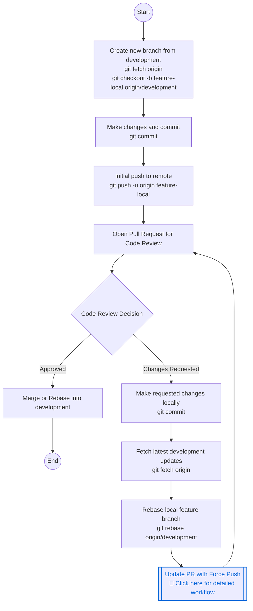

# Rebase Workflow Full Lifecycle

This document outlines the complete lifecycle of a feature branch in a rebase-based workflow, from creation to merging. 

For the specific details on how to safely force-push a branch after a rebase, refer to the [Unified Force-Push Workflow](unified-force-push-workflow.md) guide.

## Feature Branch Lifecycle

This diagram provides a high-level view of the process. The most complex step is updating the Pull Request after a rebase (the **Update PR with Force Push** step), because your local history has diverged from the remote history. 

To handle that specific step safely without overwriting your teammates' work, strictly follow the [Unified Force-Push Workflow](unified-force-push-workflow.md).
