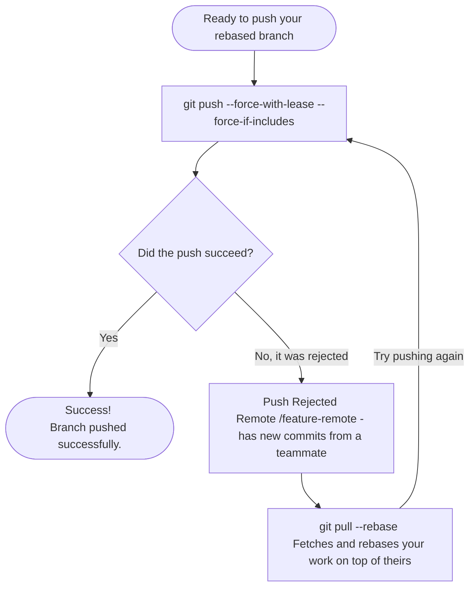

# Unified Force-Push Workflow for Linear History

> **Note:** This document zooms in on the complex process of safely force-pushing a rebased branch. To see how this fits into the complete development process, see the [Rebase Workflow Full Lifecycle](rebase-lifecycle-workflow.md).

When working with a rebase-based workflow, you often need to rewrite history locally and then update the remote branch. The safest way to do this without accidentally overwriting a teammate's work is by using the `--force-with-lease` and `--force-if-includes` flags.

The beauty of this approach is that you **do not need to know the exact state of the remote or local tracking branches**. A single, unified workflow covers all scenarios safely.

## The Workflow Decision Tree

## How It Covers Every Scenario

1. **Case 1: No one added anything new in feature-remote (e.g., you just rebased locally to update your PR after a code review)**
   - You run the initial push.
   - Git verifies that the remote matches your knowledge of it.
   - **Result:** Success. Your new rebased commits are pushed, and the old pre-rebase commits on the remote become orphaned and are replaced.

2. **Case 2: A teammate pushed new commits (Only on feature-remote)**
   - You run the initial push.
   - It **fails** because `--force-with-lease` detects that the remote branch has moved forward unexpectedly.
   - You run `git pull --rebase` to fetch their commits and replay your work on top.
   - You push again successfully.

3. **Case 3: A teammate pushed new commits AND a background fetch happened**
   - You run the initial push.
   - It **fails** because `--force-if-includes` detects that while your machine knows about the new commits, you haven't integrated them into your local history yet.
   - You run `git pull --rebase`. Since the commits were already fetched, it skips the download and directly rebases your work on top of them.
   - You push again successfully.

> **Tip:** You can make this even easier by setting `git config --global push.useForceIfIncludes true`. Once enabled, you only need to run `git push --force-with-lease` and Git will automatically apply the `--force-if-includes` protection for you.
